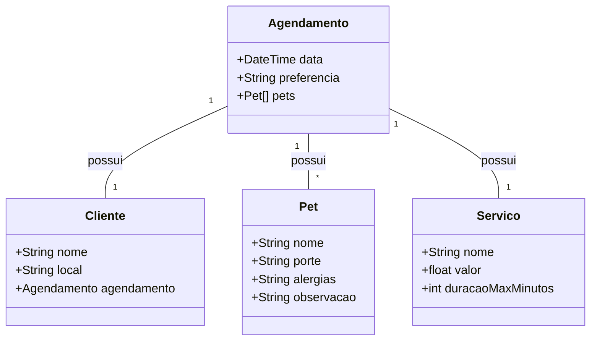

```mermaid
classDiagram
    class Cliente {
		    +String nome
        +String local
        +Agendamento agendamento
    }

    class Agendamento {
        +DateTime data
        +String preferencia
        +Pet[] pets
    }

    class Pet {
        +String nome
        +String porte
        +String alergias
        +String observacao
    }

    class Servico {
        +String nome
        +float valor
        +int duracaoMaxMinutos
    }

    Agendamento "1" -- "1" Cliente : possui
    Agendamento "1" -- "*" Pet : possui
    Agendamento "1" -- "1" Servico : possui
```